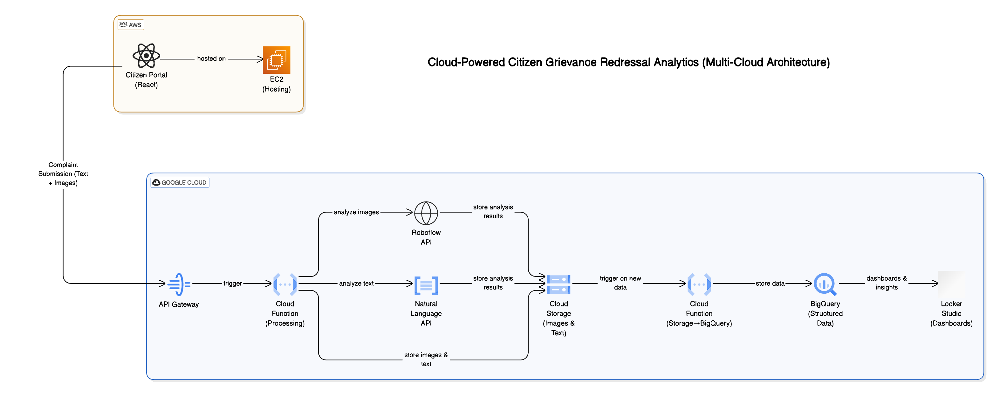
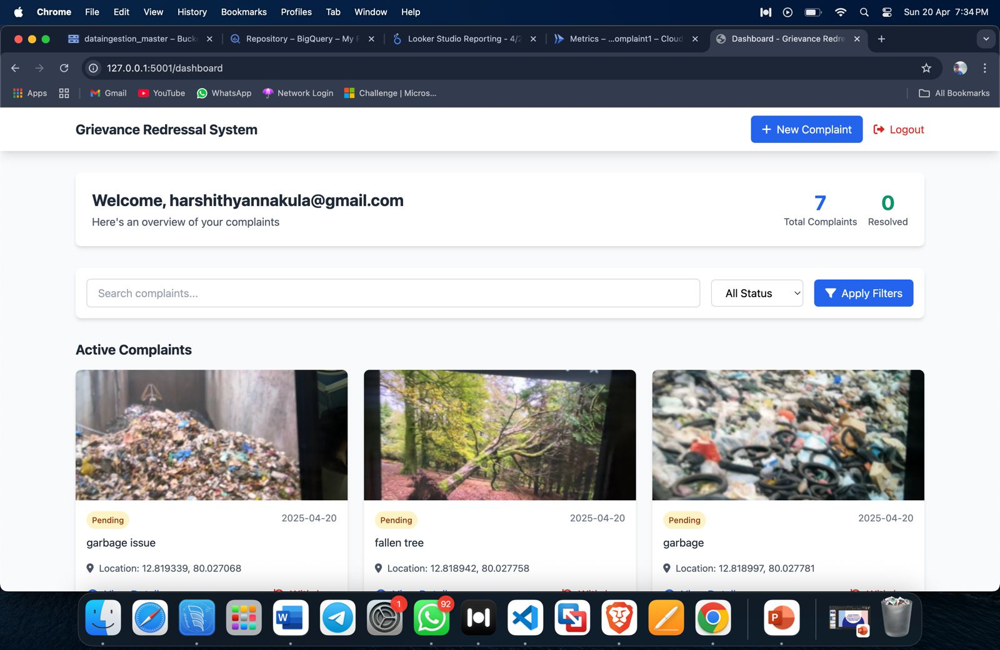
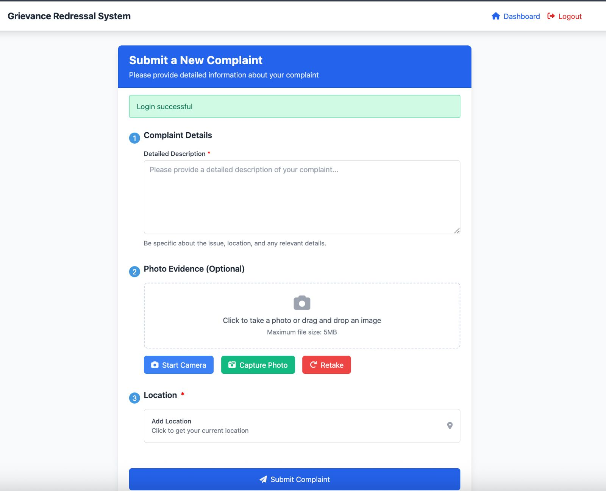
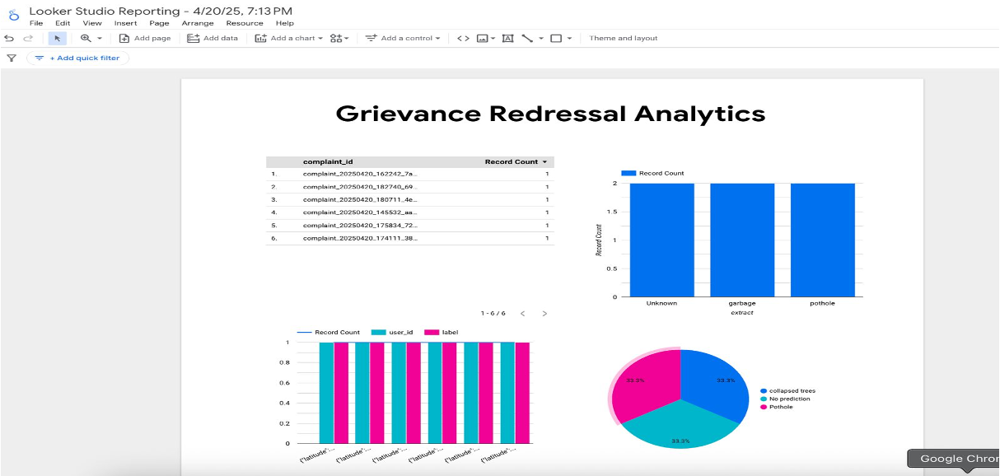

# CITIZEN_GRIEVANCE_REDRESSAL_ANALYTICS

A comprehensive web application for collecting, managing, and analyzing citizen complaints with Google Cloud integration.

## Overview

This application provides a platform for citizens to submit complaints to government authorities. Complaints are securely stored in Google Cloud Storage, categorized, and made available for analysis through Looker Studio dashboards.

## System Architecture

The system follows a modern microservices architecture with Flask backend and Google Cloud integration.



## Features

- **User Authentication**: Secure login and registration system
- **Complaint Submission**: Easy-to-use form with validation
- **Photo Upload**: Support for image attachments with complaints
- **Location Tracking**: Geolocation data capture for spatial analysis
- **Real-time Notifications**: Instant feedback on submission status
- **Complaint Withdrawal**: Option for users to withdraw submitted complaints
- **Admin Dashboard**: Comprehensive view for administrators
- **Data Analytics**: Integration with Looker Studio for advanced analytics

## Screenshots

### Main Dashboard
The main dashboard provides an overview of all complaints and their statuses.



### Complaint Submission Page
User-friendly interface for submitting new complaints with validation.



### Analytics Dashboard (Looker Studio)
Advanced analytics and visualization of complaint data.



## Technical Stack

- **Backend**: Flask 2.3.3
- **Cloud Storage**: Google Cloud Storage
- **Frontend**: Bootstrap 5.3 with Font Awesome icons
- **Authentication**: Custom user authentication system
- **Analytics**: Google Looker Studio

## Installation and Setup

### Prerequisites
- Python 3.9+
- Google Cloud account with Storage enabled
- Service account credentials

### Installation

1. Clone the repository:
   ```
   git clone <repository-url>
   cd citizen-complaints-system
   ```

2. Install dependencies:
   ```
   pip install -r requirements.txt
   ```

3. Set up environment variables:
   Create a `.env` file with the following variables:
   ```
   SECRET_KEY=your_secret_key
   BUCKET_NAME=citizen-complaints-data
   ```

4. Place your Google Cloud service account JSON file in the project root directory.

5. Run the application:
   ```
   python app.py
   ```

## Data Flow

1. User submits a complaint through the web interface
2. Data is validated and processed on the server
3. Complaint details, metadata, and attachments are stored in Google Cloud Storage
4. Administrators can view and manage complaints through the dashboard
5. Data is analyzed and visualized using Looker Studio

## Security Considerations

- All user data is encrypted during transmission and storage
- Authentication required for all sensitive operations
- Service account with minimal required permissions
- Regular security audits and updates

## Future Enhancements

- Mobile application for complaint submission
- Integration with government department APIs
- AI-powered complaint categorization and routing
- SMS notifications for status updates
- Public API for third-party integrations

## License

This project is licensed under the MIT License - see the LICENSE file for details.

## Demo

[Watch the demo video](https://drive.google.com/file/d/1Rg56JY8utIWeV_nJKFgY0svGEnf2Z-Zb/view?usp=sharing)

## Setting Up Credentials

1. Create a Google Cloud service account with access to Storage and BigQuery
2. Download the JSON key file
3. Rename it to `optical-net-452113-n9-064952459436.json` or update the reference in the code
4. Place it in the project root directory

## Contact

For support or inquiries, please contact the development team at adityagnss@gmail.com
